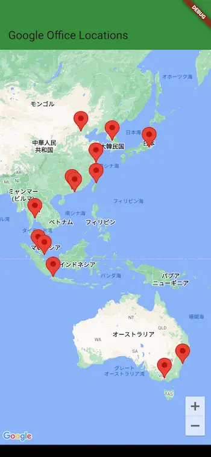

# google_maps

A new Flutter project.

## references

- [Flutter アプリに Google マップを追加する  |  Google Codelabs](https://codelabs.developers.google.com/codelabs/google-maps-in-flutter?hl=ja#0)
  - [【Flutter】クレデンシャル情報を.envファイルで取得し、ネイティブファイルで利用する方法【GoogleMap】](https://zenn.dev/ryota_exe/articles/2a42beac4ef1d8)
  - [【Flutter】環境ごとのAPIキーをiOS/Androidネイティブ側に設定する【Google Maps API】](https://zenn.dev/altiveinc/articles/flutter-set-native-api-keys-per-env)

<p align="center">
  
</p>

## memos

```shell
# deprecated
flutter pub run build_runner build --delete-conflicting-outputs
# use
dart run build_runner build --delete-conflicting-outputs
dart run build_runner build -d
```
